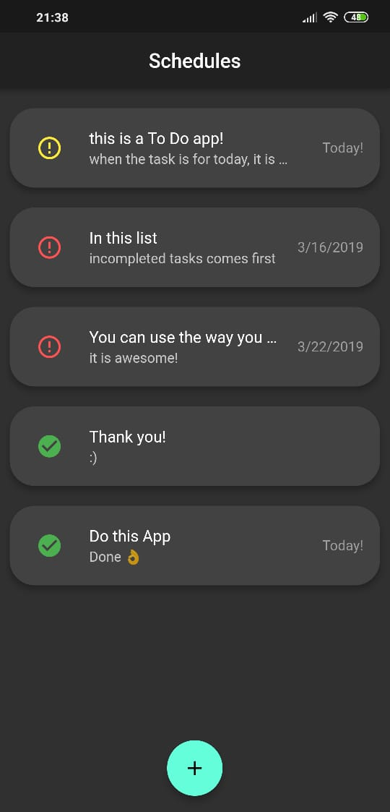

# Schedules
A Simple CRUD Schedule app developed in Flutter

# Screenshots
   

# Run App
If you want to run this app with Flutter, please [install Flutter](https://flutter.dev/docs/get-started/install).

Connect the device and run

        flutter run

## Flutter

For more information about Flutter, view the online
[documentation](https://flutter.io/).